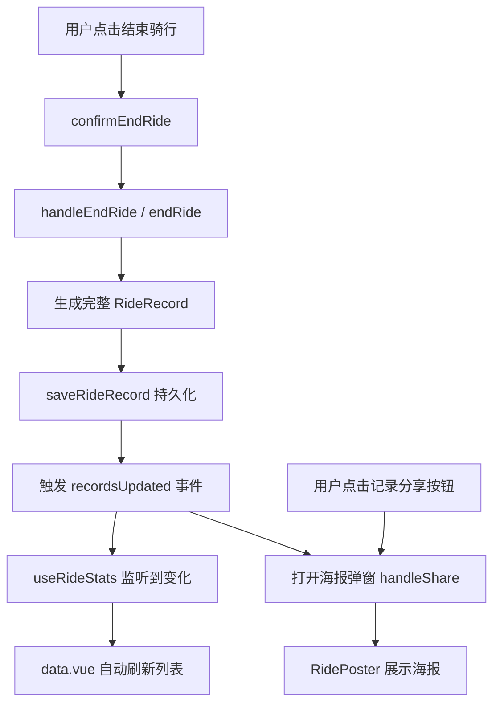

# Unify Ride Poster Dialog

Feature Name: unify-ride-poster-dialog
Updated: 2026-05-21

## Description

统一骑行结束后的海报弹窗与数据页面分享弹窗。结束骑行时将记录持久化到本地存储，数据页面自动刷新，弹窗逻辑复用数据页面的分享流程，移除 useMapData 中的冗余海报状态。

## Architecture



## Components and Interfaces

### 修改文件清单

| 文件 | 改动内容 |
|------|---------|
| `src/composables/useRideRecord.ts` | `endRide()` 增加 path/地点名称字段，确保返回完整 record |
| `src/composables/useMapData.ts` | 移除 `showPoster/completedRecord/openPoster/closePoster`，改为调用全局事件触发弹窗 |
| `src/pages/map/map.vue` | 移除 RidePoster 引用，改为监听全局海报事件 |
| `src/pages/data/data.vue` | 将 `handleShare` 和海报状态提升为全局可调用，监听 recordsUpdated 事件 |
| `src/composables/useRideStats.ts` | 增加 recordsUpdated 事件监听，自动刷新 |

### 新增全局事件总线

```typescript
// 简单的事件发布/订阅
export const rideEvents = {
  listeners: new Map<string, Function[]>(),
  emit(event: string, data: any) { ... },
  on(event: string, cb: Function) { ... },
  off(event: string, cb: Function) { ... }
}
```

### RidePoster 组件接口（不变）

```typescript
interface Props {
  record: RideRecord | null
  visible: boolean
}

interface Emits {
  close: []
}
```

## Data Models

### RideRecord (扩展)

```typescript
interface RideRecord {
  id: string
  startTime: number
  endTime: number
  duration: number        // 秒
  distance: number        // 米
  avgSpeed: number        // km/h
  routeId?: string
  routeName?: string
  startLocation: { lat: number, lng: number }
  endLocation: { lat: number, lng: number }
  startLocationName?: string   // 新增
  endLocationName?: string     // 新增
  path: Array<{lat: number, lng: number, timestamp: number}>  // 新增
  createdAt: number
}
```

## Correctness Properties

1. 结束骑行后 record 必须包含 path 数组，否则海报轨迹缩略图为空
2. saveRideRecord 必须在海报弹窗打开前完成
3. 同一时刻只能有一个海报弹窗实例
4. records 列表按 startTime 倒序排列

## Error Handling

| 场景 | 处理策略 |
|------|---------|
| saveRideRecord 失败 | toast 提示"记录保存失败"，不打开海报弹窗 |
| record 缺少 path | 海报中轨迹区域显示"轨迹未记录" |
| record 缺少地点名称 | 显示"未知位置"作为降级文案 |
| Canvas 生成失败 | 显示"海报生成失败，请重试" |

## Test Strategy

1. **功能测试**: 结束骑行 → 检查本地存储是否有新记录 → 检查弹窗是否展示数据
2. **数据完整性**: 验证 record 包含 path、startLocationName、endLocationName
3. **UI 一致性**: 对比结束骑行弹窗和分享按钮弹窗的视觉效果
4. **刷新测试**: 结束骑行后刷新页面，检查记录是否依然存在
5. **边界情况**: 骑行距离为 0、时长为 0 时的海报展示

## References

[^1]: (useMapData.ts) - 当前海报状态管理逻辑
[^2]: (useRideRecord.ts) - 骑行记录存储逻辑
[^3]: (data.vue) - handleShare 弹窗触发逻辑
[^4]: (RidePoster.vue) - 海报组件接口
